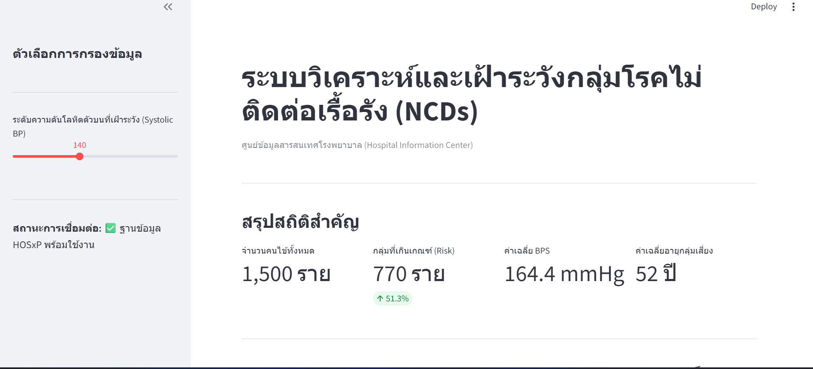

# HOSxP Data Pipeline & Analytics

โปรเจกต์วิเคราะห์ข้อมูลคนไข้ขนาดใหญ่จากระบบ HOSxP โดยใช้ Python เพื่อช่วยในการตัดสินใจทางการแพทย์และการบริหารจัดการโรงพยาบาล

---

## ข้อมูลโปรเจกต์ (Project Overview)

| หัวข้อ | รายละเอียด |
| :--- | :--- |
| **วัตถุประสงค์** | วิเคราะห์กลุ่มเสี่ยงและจัดการข้อมูล Big Data ของโรงพยาบาล |
| **เทคโนโลยีหลัก** | Python, PySpark, Streamlit, Pandas |
| **ความสามารถ** | รองรับข้อมูล 10-100 ล้านแถว, แสดงผล Dashboard แบบ Real-time |

---

## ตัวอย่างการใช้งาน (Dashboard Preview)

| หน้าจอระบบวิเคราะห์ข้อมูลคนไข้ (Official Interface) |
| :---: |
|  |
| *แสดงสถิติสำคัญ กราฟวิเคราะห์ความดัน และรายชื่อผู้ป่วยกลุ่มเสี่ยง* |

---

## รายละเอียดทางเทคนิค (Tech Stack)

| หมวดหมู่ | เครื่องมือที่ใช้ |
| :--- | :--- |
| **ภาษาหลัก** | Python 3.9+ |
| **การจัดการข้อมูล** | PySpark, Pandas, NumPy |
| **การแสดงผล** | Streamlit, Plotly |

---

## ขั้นตอนการติดตั้ง (Installation)

| ลำดับ | ขั้นตอน | คำสั่ง (Command) |
| :--- | :--- | :--- |
| 1 | Clone Repository | `git clone https://github.com/ratchanon-noknoy2318/hosxp-data-pipeline.git` |
| 2 | เข้าสู่ Folder | `cd hosxp-data-pipeline` |
| 3 | สร้าง Virtual Env | `python3 -m venv venv` |
| 4 | เปิดใช้งาน Virtual Env | `source venv/bin/activate` |
| 5 | ติดตั้ง Library | `pip install -r requirements.txt` |

---

## วิธีการใช้งาน (Usage)

| การทำงาน | คำสั่ง (Command) |
| :--- | :--- |
| **รัน Dashboard** | `streamlit run src/app.py` |
| **URL สำหรับเข้าชม** | `http://localhost:8501` |

---

## โครงสร้างไฟล์ (Project Structure)

| โฟลเดอร์/ไฟล์ | หน้าที่ |
| :--- | :--- |
| `src/app.py` | ไฟล์หลักสำหรับรัน Streamlit Dashboard |
| `requirements.txt` | รายชื่อ Library ทั้งหมดที่ต้องใช้ |
| `README.md` | เอกสารอธิบายโปรเจกต์ |

---

## ผู้จัดทำ (Author)
* **Ratchanon Noknoy**
* GitHub: [@ratchanon-noknoy2318](https://github.com/ratchanon-noknoy2318)
